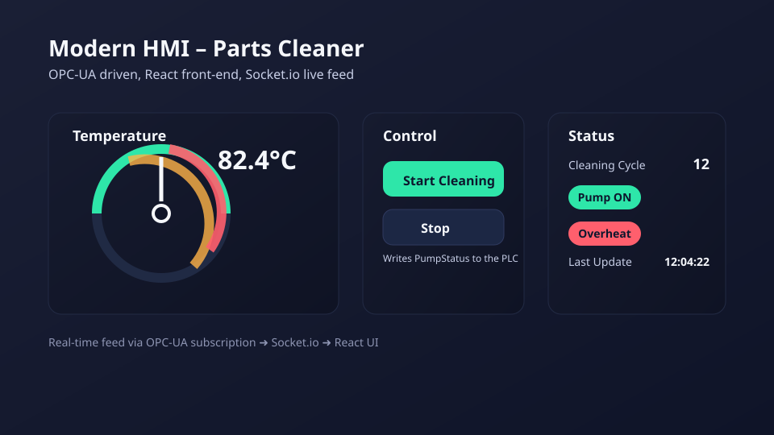

# Portfolio Report – Modern Web HMI

Use this as a ready-to-send overview for applications. Swap the placeholder SVG with real UI screenshots after running the app (`docker compose up` then capture from http://localhost:3000).

## Overview
- Project: Next-Gen Industrial Web HMI
- Tech: OPC-UA (node-opcua), Node.js (Express + Socket.io), React UI
- Machine Model: Simulated parts cleaner with Temperature, PumpStatus, CleaningCycleID, Overheat_Alarm



## What it demonstrates
- Real-time telemetry (<50 ms path) from OPC-UA subscription pushed over WebSockets into React state
- Bi-directional control: Start/Stop writes `PumpStatus` to the PLC; cycle counter increments on start
- Alarm handling: Overheat trips at 90°C and forces pump off

## How to run quickly
```bash
cd modern-hmi
docker compose up --build
# open http://localhost:3000
```

## Talking points for interviews
- Replaced legacy polling with event-driven Socket.io feed, cutting UI latency
- Modeled a PLC tag set (Temperature, PumpStatus, CleaningCycleID, Overheat_Alarm) in OPC-UA with simulated thermal dynamics
- Designed a simple React HMI with gauge + control + status lights to mirror industrial panels

## Evidence to include
- Screenshot of the live gauge and status lights while temperature ramps
- Short clip (optional) showing Start/Stop toggling PumpStatus and Overheat alarm triggering
- Snippet from `src/plc-simulator.js` that encodes the overheat safety cutout
